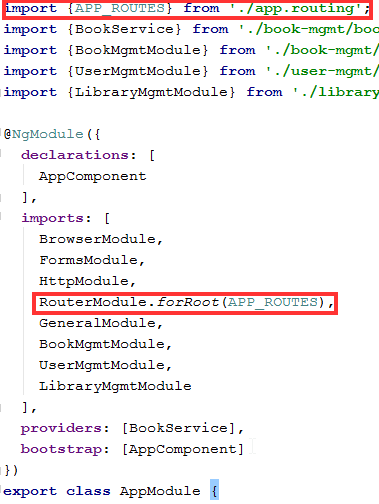

= Wykład 5 - SPA, Angular

Link do prezentacji: https://pwr-piisw.github.io/wyklady/angular_1.html#/

== Wprowadzenie
Framework Angular jest jednym z dwóch najważniejszych obecnie frameworków wykorzystywanych do implementacji aplikacji SPA w środowisku JavaScript. Jest to kompletne narzędzie w skład którego wchodzą także:

* Angular Router do obsługi nawigacji międzykomponentowej oraz do interakcji z paskiem adresu.
* RxJS - środowisko programowania reaktywnego.

Dodatkowo, dla Angulara tworzone jest wiele bibliotek, m.in.:

* Angular Material - zestaw widgetów.
* NgBootstrap - implementacja biblioteki Bootstrap dla Angulara.
* NgxBootstrap - inna implementacja biblioteki Bootstrap dla Angulara.
* NgRX - implementacja wzorca Redux dla Angulara.

== Środowisko developerskie
Lokalne środowisko developerskie dla aplikacji angularowych składa się z następujących komponentów: NodeJS, NPM (albo Yarn) oraz Angular CLI. Nie należy także zapominać o narzędziach IDE, w szczególności polecane są IntelliJ Ultimate, WebStorm, Visual Studio Code.

=== NodeJS
Node JS to środowisko wykonywawcze dla JavaScript, serwer HTTP oraz cały ekosystem narzędzi developerskich, w szczególności zaś repozytorium pakietów / bibliotek jak NPM registry oraz narzędzia zarządzające pakietami jak NPM czy Yarn.

Ponieważ środowisko JavaScriptowe dość swobodnie podchodzi do kwestii kompatybilności, często przydaje się dostęp do wielu różnych wersji narzędzia NodeJS. Zarządzanie wersjami NodeJS bardzo ułatwia NVM (node version manager). NVM dostępny jest tylko dla środowisk Unixowych (Linux, MacOS), ale istnieją porty na system Windows, np: https://github.com/coreybutler/nvm-windows

NVM jest narzędziem CLI z dobrą dokumentacją.

=== NPM
Podstawowy menedżer pakietów dla Node JS. NPM jest domyślnie instalowany przez NVM (wersja NodeJS determinuje wersję NPM). NPM posiada następujące cechy:

* umiejętność instalowania pakietów globalnie jak i lokalnie (w ramach projektu),
* zależności lokalne instalowane są w katalogu `node_modules`,
* zależności rozumiane są jako bezpośrednie i pośrednie,
* NPM potrafi przechowywać różne wersje tych samych bibliotek, o ile przechodnie wersje zależności tego wymagają,
* katalog `node_modules` ma tendencję do osiągania monstrualnych rozmiarów,
* NPM honoruje zasady semver (semantic versioning),
* NPM potrafi aktualizować biblioteki stosując tzw. miękkie zależności.

=== Angular CLI
Angular CLI to narzędzie wspomagające pracę z aplikacjami angularowymi. Angular CLI uruchamiamy komendą `ng`. Angular CLI wygodnie jest zainstalować z pomocą NPM jako globalną zależność. Angular CLI posiada następujące cechy:

* generowanie nowej aplikacji Angulara,
* generowanie nowych elementów aplikacji Angulara jak moduł, komponent, serwis,
* uruchamianie aplikacji w trybie developerskim: `ng serve`,
* budowanie aplikacji: `ng build`,
* budowanie wersji produkcyjnej: `ng build --prod`,
* migracja do nowszej wersji Angulara: `ng upgrade`.

== Opis aplikacji Bookstore
Aplikacja Bookstore dostępna jest w repozytorium [Bookstore](https://github.com/pwr-piisw/bookstore). Jest to referencyjny projekt Angularowy z backendem napisanym w Javie. Jest on podstawą dla listy nr 5, jest też przykładem, w jaki sposób można konstruować proste aplikacje z backendem i frontendem. W tym punkcie przedstawimy podstawowe cechy tego projektu.

=== Modułowość
Klient Angularowy oraz Backend zrealizowane są jako dwa moduły Mavena. Znajdują się one odpowiednio w folderach `frontend` oraz `backend`. Proszę zwrócić uwagę, że nie ma formalnej zależności między tymi modułami - moduł `backend` po prostu kopiuje pliki pochodzące z folderu `dist` modułu `frontend` do swoich zasobów webowych tylko po to, aby serwować te pliki z własnego serwera HTTP.

=== Backend
Backend zrealizowano jako bardzo prostą aplikację w Javie napisanej z użyciem biblioteki WebFlux (jest to reaktywny serwer webowy).

Wewnętrzna struktura pakietowa wyróżnia:

* podmoduł `domain` - zawierający logikę biznesową,
* podmoduł `app` - zawierają kod powiązany z infrastrukturą - w tym wypadku z serwerem webowym (`app/rest`)  oraz z implementacją prostego mechanizmu zarządzania stanem (`app/store`).

Mimo swojej prostoty, moduł `backend` można łatwo rozszerzać, dodawać nowe endpointy oraz bardziej zaawansowane mechanizmy utrwalania danych (np. JPA, MongoDB itp).

=== Frontend
Moduł zawarty w folderze `frontend` został wygenerowany przy użyciu Angular CLI a następnie zmodyfikowany do naszych potrzeb. 

Moduł posiada własny plik `pom.xml` - co jest akurat specyficzne dla środowiska Javowego. Istnieje jednak bardzo dobra integracja JavaScriptowego środowiska w Mavenie, dzieki pluginowi `frontend-maven-plugin`. Plugin ten pozwala na zarządzanie lokalną wersją NodeJS oraz NPM, dzięki czemu możliwe jest wykonywania skryptów NPM i komend Angular CLI nawet na zdalnym środowisku CircleCI - w tym wypadku nie ma konieczności stosowania innych obrazów Dockerowych - wystarcza obraz Java.

Wewnątrz folderu `frontend` można wykorzystywać komendy `npm` oraz `ng`, przy założeniu, że są one globalnie dostępne. Pomimo istnienia `frontend-maven-plugin` zaleca się korzystać z własnej instalacji NodeJS przy pracy z projektem na lokalnej maszynie.

Aplikacja Angularowa znajduje się w folderze `src/app`. Istnieje tam w tej chwili jeden moduł `books`. Dalsza struktura folderów ma następujące znaczenie:

* `app/books/model` - folder dla definicji obiektów modelu (głównie data transfer objects).
* `app/books/shared` - folder dla elementów współdzielonych przez wszystkie komponenty w module `books`.
* `app/books/shared/services` - folder dla serwisów używanych w ramach modułu.
* `app/books/book-list` - komponent "top level" realizujący widok listy książek. Inne komponenty `top-level` należy umieszczać także na poziomie `books`.
* `app/books/book-list/book-panel` - komponent "dummy", prywatny dla "book-list". Wszelkie prywatne komponenty umieszczamy wewnątrz hierarchii komponentu "top-level".

W głównym katalogu aplikacji (`app`) znajdują się także następujące istotne pliki źródłowe:

* `app.component.*` - główny komponent aplikacji - wewnątrz niego osadzone są wszystkie inne komponenty "top level".
* `app-routing.module.ts` - kod routera dla aplikacji Bookstore.

== Architektura
Angular jest realizacją architektury aplikacji "Single Page Application", którą poznaliśmy już na pierwszym wykładzie.

image::img/rich-front-architecture.svg[]

Angular odpowiada za całość implementacji po stronie przeglądarki, łącznie z Routerem, przy czym Router jest modułem opcjonalnym.

image::img/angular-architecture.png[]

== Podstawowe elementy Angulara
=== Moduły
Moduł (`NgModule`) to podstawowy mechanizm konstruowania aplikacji Angularowej. Moduł służy do grupowania elementów należących i realizujących wspólną poddomenę. Moduły Angulara pełnią podobną rolę do modułów javaScriptów, nie należy jednak ich mylić ze sobą. Aby uniknąć pomyłek, będziemy używać nazwy NgModule.

Moduły NgModule przechowywane są w osobnych folderach wewnątrz aplikacji. Każdy NgModule opisywany jest przy pomocy pliku `*.module.ts`:

[source,typescript]
----
import {NgModule} from '@angular/core';
import {CommonModule} from '@angular/common';
import {BookListComponent} from './book-list/book-list.component';
import {BookPanelComponent} from './book-list/book-panel/book-panel.component';

@NgModule({
  declarations: [
    BookListComponent,
    BookPanelComponent
  ],
  imports: [
    CommonModule
  ]
})
export class BooksModule {
}
----

Moduł pozwala zarządzać zależnościami wewnątrz aplikacji, zarówno wewnętrznymi jak i zewnętrznymi. Deklaracja zależności modułowych następuje wewnątrz dekoratora `@NgModule`, znajdują się tam kolekcje o następujących właściwości:

* `providers` - lista klas obiektów, które będą mogły być wstrzyknięte przez Angular Injector w ramach tego modułu. Wykorzystywane w przypadku np. lokalnych serwisów.
* `declarations` - lista klas komponentów, które są zadeklarowane w ramach tego modułu.
* `imports` - lista klas komponentów, które są importowane i mogą być użyte wewnątrz tego modułu. Są to zarówno komponenty pochodzące z innych, zewnętrznych bibliotek (np. Angular Material, ale także biblioteki samego Angulara, np. Angular Forms) ale także komponentów z innych modułów danej aplikacji.
* `exports` - lista komponentów zadeklarowanych lub zaimportowanych przez dany moduł, które są eksportowane, czyli są dostępne dla innych modułów (można je importować w innych modułach).
* `entryComponents` - lista komponentów, które mogą być dynamicznie ładowane przez moduł, wykorzystywane np. do deklarowania komponentów okien dialogowych.

Nowy moduł można wygenerować przy pomocy Angular CLI:

[source,bash]
ng generate module <name>

Więcej szczegółów uzyskać można w dokumentacji Angulara: https://angular.io/cli/generate#module-command
Więcej informacji na temat samych modułów tamże: https://angular.io/guide/ngmodules

=== Komponenty
Komponent jest podstawową jednostką, przy pomocy której zbudowana jest każda aplikacja Angularowa. Komponent jest elementem wizualnym, tj może on być wyrenderowany na ekranie (w modelu DOM dokumentu HTML) i służy do prezentacji danych oraz reagowania na akcje wykonywane przez użytkownika.

Komponent składa się z nastepujących elementów:

* kod komponentu (klasa Typescript) pełniący funkcję kontrolera,
* template komponentu (fragment HTML z możliwością stosowania dyrektyw),
* prywatny arkusz styli (dokument CSS, SCSS lub inny wspierany).

Elementy te mogą być zgrupowane w ramach jednego pliku, najczęsciej jednak stosuje się kilka niezależnych plików źródłowych:

* `<nazwa>.component.html` - dla template,
* `<nazwa>.component.scss` - dla arkusza styli,
* `<nazwa>.component.ts` - dla kodu komponentu.

Dla kodu komponentu może istnieć także zestaw testów jednostkowych: `<nazwa>.component.spec.ts`.

Komponent musi być zadeklarowany w ramach modułu (musi znaleźć się w kolekcji `declarations`). Komponenty najczęściej deklarowane są w ramach dedykowanego folderu. Możliwe - i zalecane - jest zagnieżdżanie komponentów w sobie w sytuacji, gdy deklarujemy komponenty prywatne, używane wewnętrznie przez inny komponent.

Komponenty mogą komunikować się między sobą na kilka sposobów. To zagadnienie jest szczegółowo opisane w innym punkcie tego dokumentu.

Komponenty można wygenerować z użyciem Angular CLI:

[source,bash]
----
cd src/app
ng generate component <name>
----

Nazwa komponentu może (powinna) być poprzedzona nazwą modułu oraz ewentualnie nazwą komponentu-rodzica.

Więcej informacji na temat Angular CLI: https://angular.io/cli/generate#component-command
Więcej informacji na temat komponentów: https://angular.io/guide/displaying-data

=== Template
Angular nie wprowadza własnej notacji do reprezentacji Template'ów, ale raczej stosuje rozszerzenie języka HTML. W efekcie, template definiuje fragment dokumentu HTML'a, który będzie zastępował każdorazowo wystąpienie komponentu w nadrzędnym dokumencie HTML.

Kod komponentu (`<name>.component.ts`) jako klasa języka TS/JS pozwala na deklarowanie pól publicznych. Takie pola dostępne są z poziomu template, dzięki czemu template może wyświetlać dane enkapsulowane przez komponent. 

Do dynamicznego budowania reprezentacji graficznej komponentu wykorzystywane są wiązania danych oraz dyrektywy, które są traktowane jak rozszerzenie języka HTML do języka template'ów Angulara. Mechanizmy to opiszemy w następnych punktach.

=== Wiązanie danych
Więcej informacji na temat zagadnień opisanych w tym punkcie można znaleźć w dokumentacji: https://angular.io/guide/user-input#user-input

==== Interpolacja
Podstawowym mechanizmem pozwalającym na powiązanie danych komponentu z widokiem jest interpolacja. Interpolacja to wyliczenie wyrażenia ujętego w podwójny nawias: `{{ }}`. W najprostszym przypadku interpolacja pozwala na wyświetlenie zawartości publicznego pola klasy komponentu w dokumencie HTML:

[source,typescript]
----
@Component()
export class ValueComponent {

    name: string;

}
----

Możliwe jest wyświetlenie wartości `name` wewnątrz paragrafu:

[source,angular2html]
----

{{ name }}

----

Co ciekawe, każda zmiana wartości `name` spowoduje automatyczną aktualizację tekstu wewnątrz paragrafu.

==== Property binding
Wiązanie właściwości propaguje wartość do właściwości elementu. Wiązanie to działa tylko w jednym kierunku: od komponentu do HTML.

[source,angular2html]
----

<input [value]="name">

----

Wiązanie wymaga ujęcie nazwy atrybutu elementu HTML w nawiasy kwadratowe: `[value]` definiuje wiązanie własciwości `value` elementu `input`. Efektem końcowym wiązania zademonstrowanego powyżej jest wyświetlenie wartości pola `name` wewnątrz pola edycyjnego formularza HTML.

==== Event binding
Z każdym elementem DOM modelu powiązana jest pewna ilość zdarzeń, na które można reagować i obsługiwać. Jest to drugi kierunek komunikacji: od DOM modelu do komponentu Angulara. Reagowanie na zdarzenia DOM modelu w Angularze realizowane jest za pomocą wiązań zdarzeniowych (Event Binding). Aby zadeklarować takie wiązanie, należy

[source,angular2html]
----

  ...

----

[source,typescript]
----
@Component()
export class ValueComponent {
    
    onDivClicked() {
        console.log('div clicked!');
    }
}
----

Możliwe jest przekazanie do funkcji obsługi zdarzenia informacji o zdarzeniu, która zawarta jest w obiekcie `$event`:
[source,angular2html]
----

  ...

----

[source,typescript]
----
@Component()
export class ValueComponent {
    
    onDivClicked(eventData: any) {
        console.log(eventData);
    }
}
----

==== Two way binding
Kombinacja dwóch powyższych mechanizmów pozwala na stworzenie wiązania dwukierunkowego, szczególnie użytecznego w przypadku pól formularzy i kontrolek `input`:

[source,typescript]
----
@Component()
export class UserFormComponent {

    userName: string;
    streetName: string;
}
----

[source,angular2html]
----

  <input type="text" [ngModel]="userName" (ngModelChanged)="userName = $event.target.value">
  <input type="text" [(ngModel)]="streetName">

----

*Uwaga*: użyta w przykładzie dyrektywa `ngModel` dostępna jest po zaimportowaniu modułu `FormsModule`.

Warto zwrócić uwagę na skróconą notację `[( ... )]`, która jest tożsama z `[ngModel]` oraz `(ngModelChanged)`. Można ją stosować wszędzie tam, gdzie możliwe jest bezpośrednie powiązanie wartości z kontroli z polem w komponencie. Możliwe jest także zastosowanie notacji akcesorów:

[source,typescript]
----
export class UserFormComponent {
    private _userName: string;
    
    get userName() {
        return this._userName;
    }   

    set userName(value: string) {
        console.log(value);
        this._userName = value;
    }
}
----

[source,angular2html]
----

  <input type="text" [(ngModel)]="userName">

----

=== Dyrektywy
Dyrektywy to rozszerzenia języka HTML oferowane przez Angular. Mogą być one wykorzystywane w template'ach.

Podstawowe dyrektywy atrybutowe:

* `ngModel` - (znana nam już dyrektywa dostępna po zaimportowaniu modułu `FormsModule`) pozwala powiązać pola formularza z modelem.
* `ngClass` - pozwala na dynamiczną modyfikację klas CSS określonych dla danego elementu HTML.
* `ngStyle` - pozwala na dynamiczne modyfikowanie styli CSS określonych dla danego elementu HTML.

Podstawowe dyrektywy strukturalne Angulara:

* `ngFor`
* `ngIf`
* `ngSwitch`, `ngSwitchCase`, `ngSwitchDefault`

=== Serwisy
Serwisem nazywamy klasy i ich obiekty, które Angular potrafi wstrzykiwać do innych serwisów albo komponentów. Serwisy są bardzo użyteczne tam, gdzie potrzebujemy współdzielić kod ale nie bardzo jest sens tworzyć w tym celu komponent (ponieważ element taki nie posiada cech wizualnych). Serwisy Angulara są w tym sensie bardzo podobne go serwisów albo komponentów Springa.

Serwis musi być oznaczony dekoratorem `@Injectable()`.

Przykładowe zastosowania serwisów:

* Wrappery na interfejsy RESTowe służące do komunikacji np. z backendem.
* Zapewnienie środków komunikacji między komponentami (serwis staje się Singletonem przy pomocy którego komponenty mogą wymieniać się danymi).

Aby serwis był dostępny w każdym miejscu aplikacji, należy odpowiednio skojarzyć go z injectorem:
[source,typescript]
----
@Injectable({
    providedIn: 'root'
})
export class BookstoreService {

}
----

Serwis jest gotowy do użycia, należy pozwolić Angularowi na wstrzyknięcie go do komponentu albo innego serwisu. Wykorzystujemy w tym celu konstruktorowe wstrzykiwanie zależności:
[source,typescript]
----
@Component()
export class BookListComponent {
  constructor(private readonly bookstoreService: BookstoreService) {
  }
  // ...
}
----

Więcej w dokumentacji Angulara: https://angular.io/guide/dependency-injection

== Angular Router
Angular Router jest opcjonalną biblioteką pełniącą funkcję integratora aplikacji SPA oraz paska URL przeglądarki. Router realizuje następujące funkcjonalności:

* przekierowuje do odpowiedniego widoku po wpisaniu odpowiedniego adresu w pasku URL,
* aktualizuje zawartość paska URL w reakcji na zdarzenie nawigacji aplikacji SPA,
* udostępnia aplikacji zawartość parametrów żądania będących częścią adresu.

Routing inicjujemy tzw. tablicą przejść i konfigurujemy go jako moduł:

Tablica przejść jest zwykłą tablicą obiektów o określonej strukturze. Określamy w nim mapowanie ścieżek URL (path) na komponenty (component):

image::img/routing-reorganized.png[]

Przy przejściu do zadanej ścieżki Angular Router podmienia komponent wewnątrz elementu zwanego router outlet. Por: https://pwr-piisw.github.io/wyklady/angular_1.html#/8/2

Więcej informacji w dokumentacji Angulara: https://angular.io/guide/router
Wyczerpujący opis zawarto także w książce Victora Savkina: https://leanpub.com/router

== Techniki komunikacji międzykomponentowej
Dobre praktyki w projektowaniu aplikacji Angularowej obejmują dekompozycję widoków na wiele małych, współpracujących ze sobą komponentów. Współpraca komponentów opiera się na komunikacji: wymianie danych i zdarzeń. Angular oferuje kilka technik komunikacji między komponentami:

* z wykorzystaniem wiązań (bindings),
* z wykorzystaniem serwisów,
* przy wykorzystaniu relacji parent-child.

Więcej informacji: https://angular.io/guide/component-interaction

== Komunikacja z backendem
Więcej informacji w dokumentacji Angulara: https://angular.io/guide/http

== Bibliografia

* https://pwr-piisw.github.io/wyklady/angular_1.html#/
* https://github.com/pwr-piisw/bookstore
* https://angular.io/cli/generate
* https://angular.io/guide/ngmodules
* https://angular.io/guide/displaying-data
* https://angular.io/guide/user-input
* https://angular.io/guide/router
* https://angular.io/guide/http
* https://angular.io/guide/dependency-injection
* https://leanpub.com/router
* https://angular.io/guide/component-interaction
